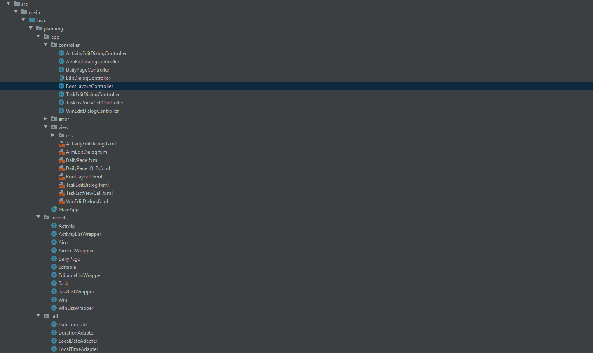
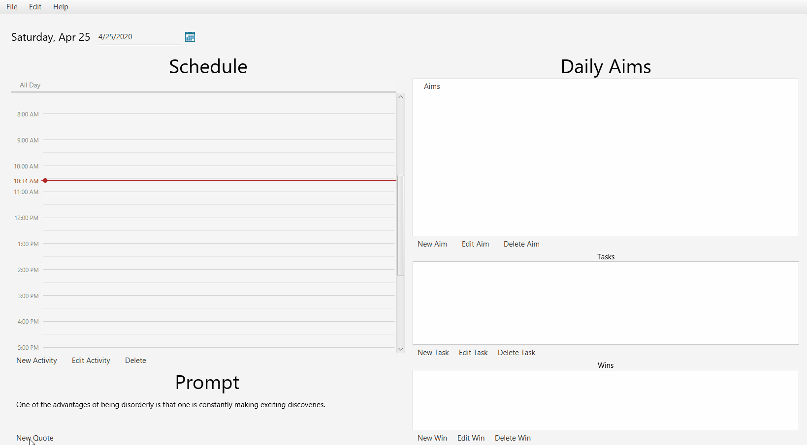
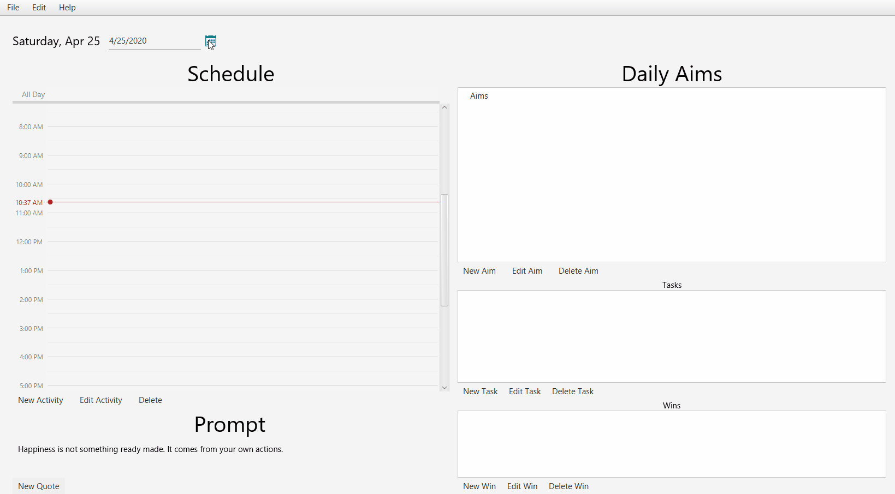
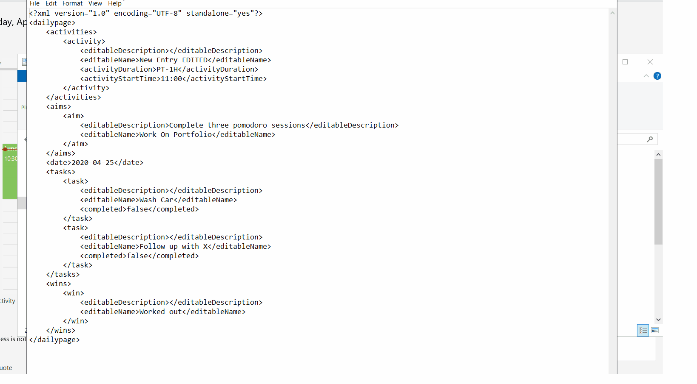
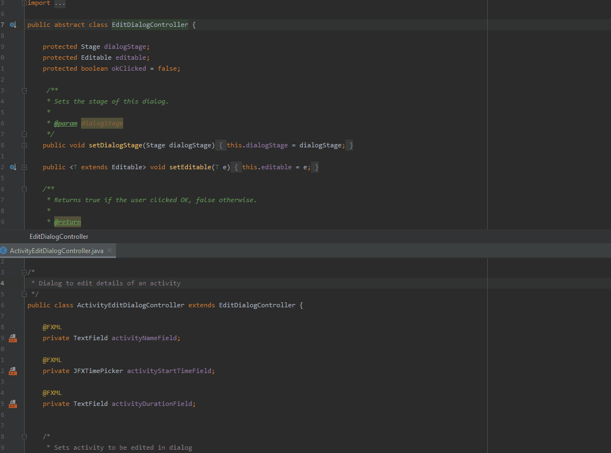
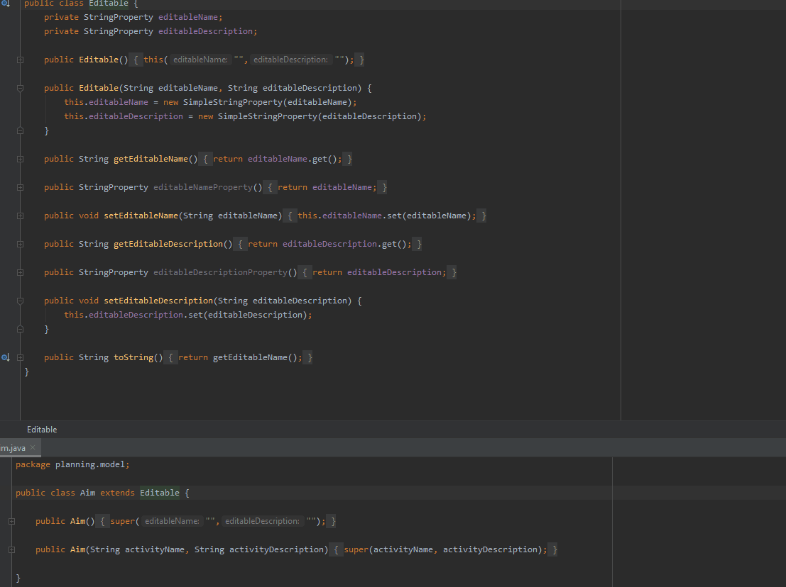

# Daily Planning App

This app was designed with the intent of learning GUI application programming, the development of larger scale applications with larger code bases (roughly 1850 LOC as of 4/25/20), and the Model View Controller

design pattern.

This application is written using JavaFX, a GUI library for the Java programming language.

## Design and Features

## MVC Scalable Architecture

## Quote of Day 

## Event Scheduling

## Persistent Data and XML Marshalling

## Use of Inheritance To Write DRY, Easily Scalable Code

